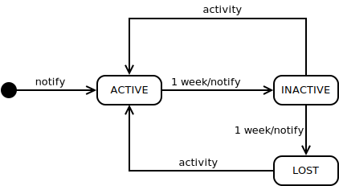
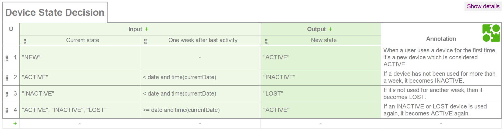

Device Monitor
==============

A simple workflow for device activity management implemented as an state machine.

Its features include:

* Device states easily added and dynamically loaded using a CDI 1.2 container.
* Dynamic state transitions using an external DMN 1.1 table that can be readed from anywhere.

Activity diagram
----------------

The automaton describing the state machine is:

State Decision Table
--------------------

To see and edit the transitions used for testing, go to the [DMN Toolkit demo](http://demo.bpmn.io/dmn/new) 
and load the [device-rules.dmn](workflow/src/test/resources/device-rules.dmn) file.

To use the table, the workflow state machine injects the DMN model from a 
`@DeviceMonitor`-qualified `org.camunda.bpm.model.dmn.DmnModelInstance`
(in the workflow tests you will find an example for this).

Building and Testing
--------------------

To build the project and run the tests using Maven, go to the root folder and run the command: 

`mvn clean install`

